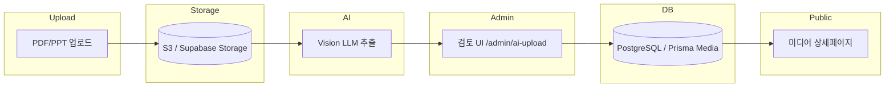
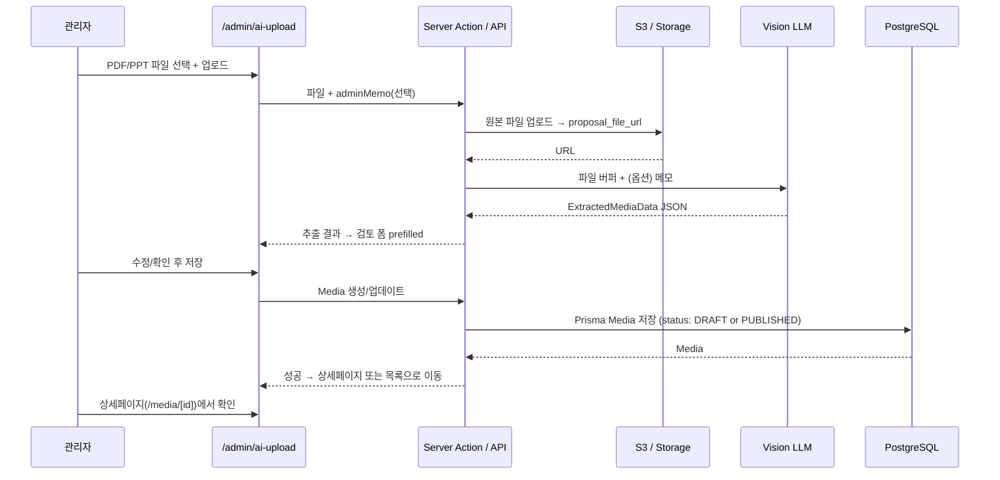

# AI 미디어 자동 등록 아키텍처 (THINKKAD 스타일)

> 운영 시 프롬프트 정책/체크리스트는 `docs/AI_UPLOAD.md`의 **운영 프롬프트 정책 (중요)** 섹션을 기준으로 관리합니다.

## 1. 전체 흐름 다이어그램 (Mermaid)



## 2. 상세 시퀀스 (Mermaid)



## 3. ASCII 아트 요약

```
[ 관리자 ]  →  [ PDF/PPT 업로드 ]  →  [ S3 저장 ]
                                              ↓
[ 검토 UI ]  ←  [ Vision LLM 추출 ]  ←  (파일 URL/버퍼)
     ↓
[ DB 등록: Media ]  →  [ 상세페이지 /media/[id] ]
```

- **입력**: PDF(또는 PPT) 파일 + 선택적 admin_memo  
- **저장소**: S3 또는 Supabase Storage → `proposal_file_url`  
- **추출**: Vision LLM → `ExtractedMediaData` (Prisma Media와 1:1 매핑 가능)  
- **검토**: `/admin/ai-upload`에서 prefilled 폼 수정 후 저장  
- **출력**: Media 레코드 → 상세페이지 노출

## 4. PDF Vision + Supabase 샘플 이미지 (MVP)

1. **환경변수**
   - `XAI_API_KEY` + 텍스트 모델(`XAI_MODEL`, 예: `grok-3`)
   - `XAI_VISION_MODEL=grok-4` (또는 콘솔 Models의 vision 지원 모델)
   - Supabase 업로드(선택): `SUPABASE_URL`, `SUPABASE_SERVICE_ROLE_KEY`, 버킷 `proposal-samples`(또는 `SUPABASE_PROPOSAL_SAMPLES_BUCKET`)
2. **동작**: PDF 텍스트로 구조화 추출 후, 키워드·표 의심 페이지 최대 8장을 JPEG(q75, 1024px)로 렌더 → Grok Vision이 `sample_image_descriptions` + `best_photo_pages` JSON 반환 → 상위 1~3장을 Storage에 올려 `Media.sampleImages`에 저장. 설명은 `description`/`additional`에 병합.
3. **폴백**: Vision 400/403·모델 오류 시 텍스트만 유지하고 `[Vision] 이미지 분석 실패: PDF 원본 확인하세요` 안내.
4. **테스트**
   - 키워드가 들어간 페이지(예: 「현장사진」「LED」「도면」)가 있는 텍스트+이미지 혼합 PDF 준비.
   - `.env.local`에 Vision 모델 설정 후 관리자 PDF 업로드 → 서버 로그에 `[pdf-page-images] Vision JPEG…`, `[grok-structured] Vision 페이지:` 확인.
   - Supabase 버킷 **Public** 읽기 정책 설정 후 초안 발행 → `/medias/[id]` 갤러리에 샘플 썸네일 우선 노출.
   - Vision 비활성 테스트: `PDF_VISION_DISABLE=1` 또는 잘못된 Vision 모델로 폴백 문구 확인.
5. **DB**: `npx prisma db push` 로 `Media.sampleImages` 동기화.

## 5. 관리자 매체 사진 추가 업로드 (`/admin/ai-upload`)

- **버킷**: Supabase Storage `media-samples` (Public). 환경변수 `SUPABASE_MEDIA_SAMPLES_BUCKET` 로 이름 변경 가능.
- **흐름**: 이미지 최대 5장(각 10MB) → `media-samples` 업로드 → Grok Vision(`XAI_VISION_MODEL`, 기본 `grok-4`)으로 한국어 설명 → 제안서 PDF 추출 초안마다 본문·이미지 필드에 병합.
- **비용**: 동일 배치에서 「분석·업로드 실행」 후 제안서 업로드 시 캐시되어 Vision 1회만 호출. 미리 실행 없이 제안서만 올리면 그때 1회 분석.
